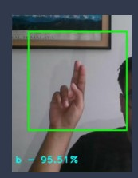

# American_Sign_Language_detection
 an implementation of a deep learning model for detecting and classifying American Sign Language (ASL) gestures in real-time. The model is built using convolutional neural networks (CNNs) and is trained on a large dataset of ASL hand gestures.
 
 ### Libraries / Frameworks used
 -Tesnorflow
 -numpy
 -mediapipe
 -cv2
 
 ### Neural Network training
 - Convolution2D filters = 64, Kernal Size = (4,4), image size = 200x200x3, activation = Relu, dropout = 0.5
 - Convolution2D filters = 128, Kernal Size = (4,4), strides=1, activation = Relu, dropout = 0.5
 - MaxPooling2D (2,2)
 - Convolution2D filters = 256, Kernal Size = (4,4), strides=1, activation = Relu
 - MaxPooling2D (2,2)
 - Convolution2D filters = 512, Kernal Size = (4,4), strides=1, activation = Relu
 - MaxPooling2D (2,2)
 -  FLATTEN
 -  Dense neurons = 128, activation = Relu
 -  Dense neurons = 512, activation = Relu
 -  Dense neurons = 29, activation = Softmax

Example Image:

